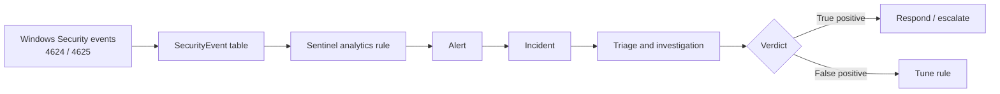

# Detection Engineering: Detecting Credential Attacks in Microsoft Sentinel

**Scope:** Custom detection rules, attack simulation, alert triage, incident investigation, reporting
**Tools:** Microsoft Sentinel, KQL, Windows Security logs, MITRE ATT&CK


## Overview

This project covers detection and response: writing detection rules in Sentinel, simulating the attacks they target, and investigating the resulting alerts the way a SOC analyst would.

Lab Diagram.


Log collection is covered separately in the (https://github.com/Tigerlove101/Onboarding-On-Prem-Windows-Servers-to-Azure-Arc-at-Scale-Using-Group-Policy)  This project assumes Windows Security events from the lab machines are already available in the `SecurityEvent` table.

## Threat model

| Attack | Why it matters | ATT&CK |
|---|---|---|
| Brute force | Repeated wrong password attempts against the Active Directory accounts to avoid lockout followed by successful logon  | T1110.001 Password Guessing |
| Brute force | Repeated guesses against a single account | T1110.001 Password Guessing |

**Design decision.** The lab's AD account lockout threshold is set to 3, which already limits single-account brute force. Spraying works around that control by trying few passwords against many accounts, so the flagship detection correlates failed logons across accounts by source IP. A single-account brute-force rule is kept as a complementary detection.

## Detection workflow



## Detection rule1: Brute-force password guessing. 

| # | Detection | Severity | ATT&CK | Events |
|---|---|---|---|---|
| 1 | Password guess: multiple failed logons followed by a successful logon | High | T1110.003 | 4625 |
| 2 | Brute force: repeated failed logons against one account | Medium | T1110.001 | 4625 |

Rules are created in Sentinel (Microsoft Defender portal) under **Microsoft Sentinel > Configuration > Analytics > Scheduled query rule**.


**Logic.** Repeated failures against Active Directory account followed by a successful logon.  the account lockout policy does not apply to the Active Directory Admin account.


### Detection rule2: Brute force

**Logic.** Repeated failures against one account from one source. The threshold is aligned to the account lockout policy.


```kql
SecurityEvent
| where EventID == 4625
| where IpAddress !in ("-", "", "::1", "127.0.0.1")
| summarize FailedAttempts = count(),
            FirstAttempt = min(TimeGenerated),
            LastAttempt = max(TimeGenerated)
    by IpAddress, TargetUserName, Computer
| where FailedAttempts >= 5
```


| Setting | Value |
|---|---|
| Run every / lookback | [for example 5 min / 10 min] |
| Entity mapping | Account: `TargetUserName`, IP: `IpAddress`, Host: `Computer` |

## Attack simulations

All tests were run in an isolated lab against dedicated test accounts.

| Test | Simulated behavior | Expected rule | Result |
|---|---|---|---|
| 1 | successful login after multiple failed attempt accounts | Detection 1 | [Fired] |
| 2 | Repeated bad passwords against one account | Detection 2 | [Fired] |

Simulation method and tooling: I intentionally typed in wrong passwords multiple times followed by a correct password from the Active Directory computer keyboard to trigger the alert. I discovered the account lockout policy does not apply to the Active Directory default account. 

## Incident report


### Incident 1:

| Field | Value |
|---|---|
| Detected | [2026-10-02T15:04:48.9657388Z] |
| Severity | [medium] |
| Triggering rule | [Brute-force 2] |
| Source IP | [172.0.0.1] |
| Target accounts | [moni/betty] |
| Target host | [mo2] |
| ATT&CK | [T1110.003] |
| Verdict | [expected]|


### Incident 2:

| Field | Value |
|---|---|
| Detected | [2026-10-02T15:49:06.1858102Z] |
| Severity | [High] |
| Triggering rule | [Brute-force-password guessing] |
| Source IP | [172.0.0.1] |
| Target accounts | [moadmin] |
| Target host | [mo-svr] |
| ATT&CK | [T1110.003] |
| Verdict | [expected]|


**Triage.** The alert reported brute-force account . The activity was expected.

**Investigation.** Pivoted on the source IP to see every account and host involved, and checked whether any attempt succeeded:


**Closure notes.** The similation and alert generated were all expected.

## Triage and escalation

For each alert:

1. Is the source internal or external, and is it normal for that host?
2. How many accounts are affected, and are any privileged?
3. Did any attempt succeed after the failures?
4. What happened after a successful logon?
5. Is this expected activity (admin task, service account, authorized test)?

## Closing note :
This doesn't need to be escalated because it is expected.a privileged account is targeted, a successful logon follows the failures, multiple hosts are involved, or later activity suggests persistence or lateral movement.


## Skills demonstrated

Detection engineering | KQL | Microsoft Sentinel | MITRE ATT&CK | Alert triage | Incident investigation | Windows Security event analysis | Incident documentation |
